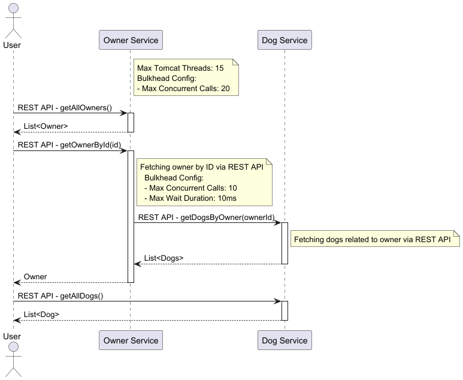

# Resilient Microservice Design – Bulkhead Pattern

This project demonstrates the implementation of the Bulkhead Pattern in a Spring Boot application using Resilience4j. The Bulkhead Pattern helps to manage and isolate failures in one part of an application without affecting the rest of the application's functionalities, thus increasing the overall system resilience.

## Understanding the Bulkhead Pattern
The Bulkhead Pattern is crucial for building resilient microservices by isolating elements into compartments (like bulkheads in a ship). Failure in one component doesn't cascade to other components, preserving functionality in non-failed system areas and preventing a single failure from taking down the entire system.
## Context and problem
In microservices environment you have multiple services. Each of these services has one or more consumer. Failure of a service will impact the consumer of this services. When the consumer sends a request to a service that is failed or not responding, the resources used by the client's request may not be freed in a timely manner. As requests to the service continue, those resources may be exhausted.

This issue of resource exhaustion affects services with multiple consumers. A large number of requests originating from one client may exhaust available resources in the service. Other consumers are no longer able to consume the service, causing a cascading failure effect.
## Solution
The idea here is to isolate the resource based on technical and business aspect. Partition your resources in groups based on consumer load and availability requirements. One common pattern is to make sure that the resource used to call one service doesn’t impact others. For example, a consumer that calls multiple services may be assigned a connection pool for each service. If a service begins to fail, it only affects the connection pool assigned for that service, allowing the consumer to continue using the other services.

---
Let's consider a scenario where we have two services, labeled as Service A and Service B. Service A makes calls to Service B for certain APIs. Sometimes, Service B experiences slowdowns. When Service A receives multiple concurrent requests that necessitate interaction with the slow-running Service B, the performance of Service A could degrade as well. This slowdown has the potential to occupy all of Service A's threads, leaving none available for handling requests that do not depend on Service B. To mitigate this issue, the strategy involves isolating or dedicating a portion of Service A's threads specifically for handling requests to Service B. By allocating these threads in this manner, we can ensure that not all of Service A's threads are consumed, thus preventing Service A from becoming non-responsive to all requests.
In this implementation, the Resilience4j is used to handle the bulkhead configurations and service calls. Each request to the service endpoint is handled by the bulkhead, which controls the concurrent accesses according to the predefined configurations.

diagram



## Bulkhead Implementation:
1. Resilience4j.
2. Configuration
We allow max 10 concurrent requests to the rating service even when we have 15 threads.
max wait duration is for when we get any additional requests for rating service when the existing 10 threads are busy, we wait for only 10 ms and fail the request immediately.
```yaml

resilience4j.bulkhead:
  instances:
    dogService:
      maxConcurrentCalls: 10
      maxWaitDuration: 10ms
    ownerService:
      maxConcurrentCalls: 20
```
3 @Bulckhead
```java
    @Bulkhead(name = "dogService", fallbackMethod = "getDefault")
    public List<DogDto> getDogsByOwnerId(int ownerId){
        logger.info(">>execute api call");
        return restTemplate.getForObject(dogServiceEndpoint + ownerId, List.class);
    }

    public List<DogDto> getDefault(int ownerId,Throwable throwable){
        logger.info(">>Bulkhead default if all threads are occupied");
        return Collections.emptyList();
    }
```