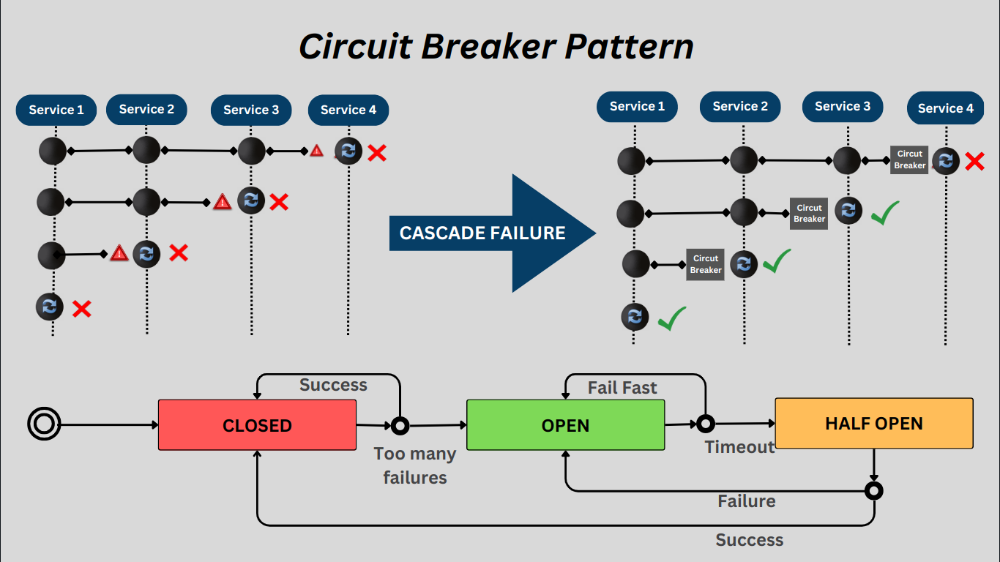
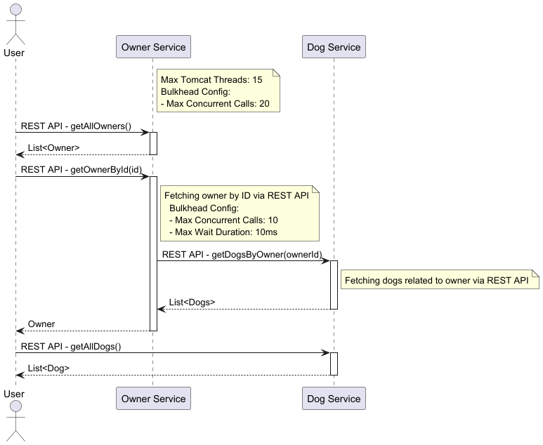

# Resilient Microservice Design – Circuit Breaker

This project demonstrates the implementation of the Circuit Breaker Pattern in a Spring Boot application using Resilience4j. 

Circuit Breaker is a design pattern used in microservices architecture where different services interacting with each other over a network,
and circuit breaker protects them from cascading failures to enhance the resiliency and fault tolerance of a distributed system.

In simple terms, a Circuit Breaker is a protective and safety mechanism that prevents your application from continuously making requests to a service that has problems or is down.

This pattern is inspired by the electrical circuit breaker, which automatically opens the circuit if the current flow exceeds a certain threshold. This prevents the circuit from overheating and causing a fire.

In a microservices architecture, it works the same way, monitors the health of a microservice and automatically blocks requests from that service if it becomes unhealthy.
diagram



### Closed:
In this state, the circuit breaker allows normal service communication, and requests go through to the service.
Circuit breaker monitors the responses from the service for errors. If the responses are successful with no issues, it remains in the closed state.

### Open:
When the number of failures reaches a threshold, the circuit breaker switches to the open state, preventing requests from reaching the service and providing a fallback response.
(Threshold Value like 5 failures within 10 seconds)

### Half-Open:
Once the timeout or reset interval passes, the circuit breaker goes to the “Half-Open” state.
It allows a limited number of test requests to pass through to the service to see if the service has recovered or not.
If the test requests succeed, it means the service has recovered and the circuit breaker goes back to “Closed” state.
If any of the test requests fails, it means the service has still issues and the circuit breaker goes to “Open” state to block further requests.




## Circuit Breaker Implementation:
1. Resilience4j.
2. Configuration
   Default Configuration:
   `slidingWindowType`: Defines the type of sliding window (COUNT_BASED in this case, which counts the number of the last N calls).
   `slidingWindowSize`: The size of the sliding window (last 10 calls are considered).
   `permittedNumberOfCallsInHalfOpenState`: Number of calls allowed when the circuit breaker is half-open before determining if it should close.
   `waitDurationInOpenState`: The time the circuit breaker stays open before transitioning to half-open to allow a limited number of test requests.
   `failureRateThreshold`: The failure rate percentage threshold to open the circuit.
   `recordExceptions`: Specific exceptions to count as failures leading potentially to changing the state of the circuit breaker.
   Specific Instance Configuration:
   `dogService`: Configures the dogService to inherit settings from default.
   `someOtherService`: Customizes settings beyond the default, with parameters including:
   `registerHealthIndicator`: If true, exports health indications.
   `minimumNumberOfCalls`: Minimum number of calls before the failure rate can be calculated.
   `eventConsumerBufferSize`: Buffer size for storing events.

    so we can create default configuration and customizable to difirenciate Resilience logic
```yaml
resilience4j.circuitbreaker:
  configs:
    default:
      slidingWindowType: COUNT_BASED
      slidingWindowSize: 10
      permittedNumberOfCallsInHalfOpenState: 10
      waitDurationInOpenState: 10
      failureRateThreshold: 60
      recordExceptions:
        - org.springframework.web.client.HttpServerErrorException
  instances:
    dogService:
      baseConfig: default
    anotherService1:
      baseConfig: default
    anotherService2:
      registerHealthIndicator: true
      slidingWindowSize: 10
      permittedNumberOfCallsInHalfOpenState: 3
      slidingWindowType: TIME_BASED
      minimumNumberOfCalls: 20
      waitDurationInOpenState: 50s
      failureRateThreshold: 50
      eventConsumerBufferSize: 10
```
3. @CircuitBreaker
```java
    @CircuitBreaker(name = "dogService", fallbackMethod = "onError")
public List<DogDto> getDogsByOwnerId(int ownerId){
    logger.info(">>DogServiceClient>>getDogsByOwnerId");

    return restTemplate.getForObject(dogServiceEndpoint + ownerId, List.class);
}

public List<DogDto> onError(int ownerId,Throwable throwable){
    logger.log(Level.SEVERE, ">>DogServiceClient>>CIRCUIRBREACKER>>onError:"+throwable.getMessage());
    return Collections.emptyList();
}
```