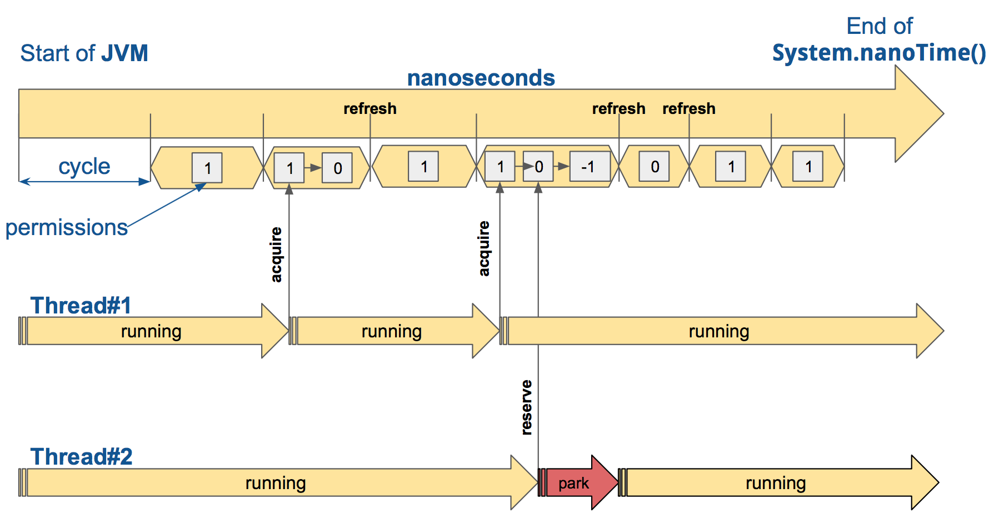

# Resilient Microservice Design – Rate Limiter

Rate limiting is an imperative technique to prepare your API for scale and establish high availability and reliability of your service. But also, this technique comes with a whole bunch of different options of how to handle a detected limits surplus, or what type of requests you want to limit. You can simply decline this over limit request, or build a queue to execute them later or combine these two approaches in some way

Resilience4j provides a RateLimiter which splits all nanoseconds from the start of epoch into cycles. Each cycle has a duration configured by RateLimiterConfig.limitRefreshPeriod. At the start of each cycle, the RateLimiter sets the number of active permissions to RateLimiterConfig.limitForPeriod.
For the RateLimiter callers it really looks like this, but for the AtomicRateLimiter implementation has some optimizations under the hood that will skip this refresh, if RateLimiter is not used actively.



## Rate Limiter Implementation:
1. Resilience4j.
2. Configuration
   + `limitForPeriod`: Maximum number of calls permitted during the limitRefreshPeriod. In this case, 5 calls.
   + `limitRefreshPeriod`: The duration for which the call limit count holds before it resets. Here it's set to 60 seconds.
   + `timeoutDuration`: The maximum time a thread will wait for permission (i.e., until it can make a call when the rate limit has been reached). If set to 0, it fails immediately if the limit is reached.
3. 
```yaml
resilience4j.ratelimiter:
   instances:
      squareLimit:
         limitForPeriod: 5
         limitRefreshPeriod: 60s
         timeoutDuration: 0
```
3 @RateLimiter
```java
    @GetMapping("/two")
    @RateLimiter(name = "twoLimiter", fallbackMethod = "limiterErrorResponse")
    public Response two() {
        return new Response(HttpStatus.OK, "one");
    }

    public Response limiterErrorResponse(Throwable throwable){
        log.warn("limiterErrorResponse>>default response: {}", throwable.getMessage());
        return new Response(HttpStatus.INTERNAL_SERVER_ERROR, "one:" + throwable.getMessage());
    }
```